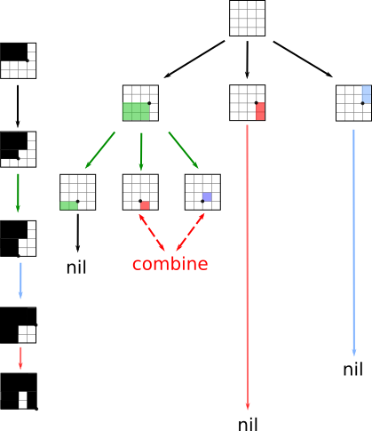

Introduction
============
In the logistics industry poorly packed boxes are wasting space, and worse,
tying up pallets that could be resold for a profit. We are in charge of
programming robots to repack the boxes.

You are given a truck full of a pallets with boxes on them that may or may
not be correctly packed. Your task is to implement an algorithm that packs
boxes onto the pallets correctly. A correctly packed pallet is one where
none of the boxes on it overlap, and none of the boxes hang over the edge of
the pallet. Pallets are packed in only two dimensions, with a single layer
of boxes which have an arbitrary height. All of the trucks are going the
same place anyway, so it doesn't matter which truck a box goes in, as long
as it is packed correctly on a pallet.

Empty pallets left over after repacking are pure profit. More empties = more
better! And if a truck leaves the warehouse with more pallets on it than it
came with, it comes out of your profit. So pack carefully!

### Requirements

Your job is to replace the current `repack.go` file with your own. You **may
not modify** the other provided Go files (`main.go`, `pallet.go`,
`generate.go`). You may add additional files.

Boxes
=====

A box is a `box struct`, including its position on the pallet `x`,`y` and
its width and length `w`,`l`. Its `id` is unique across all the boxes in one
input file.
```
type box struct {
	x, y uint8
	w, l uint8
	id   uint32
}
```

In their canonical form `b.canon()` a box is horizontal `w>h`:

```
  +--------+
h |        |
  +--------+
      w
```
Possible box types with respected size = l * w (using hex values `c=12` and
`f=16`) are: 
```
1   2 2   3 3 3   4 4 4 4

4 4   6 6 6   8 8 8 8
4 4   6 6 6   8 8 8 8

9 9 9   c c c c
9 9 9   c c c c
9 9 9   c c c c

f f f f
f f f f
f f f f
f f f f
```
These are all boxes that can be placed on a 4x4 pallet. Only these types
should occur on input.

**TODO**: Maybe create a filter for the remote case of having boxes with
dimensions bigger than 4x4.

Storing boxes
-------------
Note, that an area uniquely identifies the box type, except for an area of
4, which suggests, we can use the box size in a hash function and store the
boxes in a hash table. We have 10 distinct box types so `TABLESIZE = 10`.
To handle the 'collision' of size 4, we can use the hash `3` for 4x1 and
the hash `4` for 2x2 boxes.


For each hash value we will have a stack of boxes. If a box is repacked on
pallet, it gets popped from the stack. If a new truck comes, the new boxes
are added to the table and pushed into the corresponding stack.

### The Box stack
The box stack will operate in typical last-in-first-out (LIFO) order.
Operations we need are 
- `push` to add a new item to the front 
- `pop` to delete an item from the front
- `front` to get first element
- `isEmpty` to know if stack is empty

In the first implementation a pointer list was used. But as it turned out
the slice operations in go are so cheap that is was simpler to use them. So
`push` will simply `append` a box to the slice and `front` checks for the
last element. For more discussion, see
[here](https://groups.google.com/forum/#!msg/golang-nuts/mPKCoYNwsoU/tLefhE7tQjMJ).

Palettes
========
A pallet holds a collections of `boxes`, each in a certain place on a grid.
```
type pallet struct {
	boxes []box
}
```
All pallets have
```
const palletWidth = 4
const palletLength = 4
```
A palette string is a comma separated list of boxes and look like this:
```
0 0 1 1 101, 1 1 1 1 102, 2 2 1 1 103, 3 0 4 1 104
```
This particular pallet could be visualized as follows:
```
| @       |
|   &     |
|     #   |
| $ $ $ $ |
```
However, the legacy implementation in `pallet.go` is handling a pallet and
boxes differently as expected, as `x` and `y` or column/row major-order are switched. As this file must
not be changed the code as to account for this behavior. The coordinate
system is consequently:
```
       Y
   +------>
   |
 X |
   |
   V
```
and the box `2 1 1 1 100` is placed here:
```
|         |
|         |
|   @     |
|         |
```

Trucks
======

A truck has an unique `id` and contains a slice of `pallets`.
```
type truck struct {
	id      int
	pallets []pallet
}
```
A truck `string` starts with `truck <id>`, and ends with `endtruck`. Inside
of a truck, there's one pallet per line.
```
truck 1
0 0 1 1 101,1 1 1 1 102,2 2 1 1 103,3 0 4 1 104
0 0 1 1 101,0 0 1 1 102
0 0 5 5 101
endtruck
```

Functions
=========

Function `paint` will take a pallet (as a list of boxes) and tries to fill a
pallet grid with them.

Repackaging trucks
==================

Pack pallets as tight as possible. If a pallet is not full, hold it back
until it can be filled nicely and put it on the next truck.

1. Truck comes in
2. Unload truck and create boxes hashtable, see [above](#storing-boxes)
3. Run repackaging algorithm

Algorithm Idea
--------------

- We start with an empty 4x4 pallet as a free `gridElement` to place a box on. 

Loop:
- Pick a `box` from the `store`
- New box is placed into the upper left of current `gridElement`.
- This divides the remaining free space into 3 non-overlapping new grids: The bottom (green), right (blue) and the bottomRight (red).
- remove current `gridElement` and append these new grid elements into a list.
- Then take the last `gridElement` of that list (here the green one) and
	repeat.

Loop until `pallet` is full, i.e. the list with free `gridElements` is empty
or no more boxes are in `store`

  


### Grid
This suggest as a `gridElement` the following:
```
type gridElement {
	x,y         int  //origin
	w,l         int  //width length
	size        int
	orientation enum //horizontal, vertical, square
}
```
To keep track of the free space on the pallet, we will use a slice `type FreeGrid []GridElement` that
contains all `gridElements` and which sees and `Update()` after each cycle
in the loop.

Ordering the elements of `FreeGrid` during repacking leads to more efficient
packing, but the algo becomes slower. In tests the overall number of trucks
processed was lower and the absolute profit as well.

### Picking a box

If the new grid has, e.g., a size of 8, we look at the box hash table with
hash `8`. If the box list at `8` is empty we look downwards into lower
hashes until we find a non-emptybox stack and pick a box from that one.

If no box is found return an `emptybox`.

### Conflicts
Very small grids might occur. In the above example, if we have one more 2x1
box it could not be placed, except for we combine the two 1x1 remaining
`gridElements`.

Optimizations
-------------

- If there are many boxes of the same type in the hashtable we might just
	fill up a pallet with same sized boxes:

```
if number box.size(8)%2 == 0 {
fill as many pallets with 4x2 boxes
}
```

```
if number box.size(4)%4 == 0 {
fill as many pallets with 2x2 boxes
}
```

Resources
=========
- http://golang-challenge.com/go-challenge4/
- [vector is better than list](https://groups.google.com/forum/#!msg/golang-nuts/mPKCoYNwsoU/tLefhE7tQjMJ)
- http://nathanleclaire.com/blog/2014/07/19/demystifying-golangs-io-dot-reader-and-io-dot-writer-interfaces/
- https://github.com/golang/go/wiki/Articles
- https://github.com/golang/go/wiki/SliceTricks
- https://golang.org/pkg/fmt/

